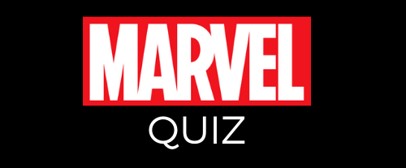
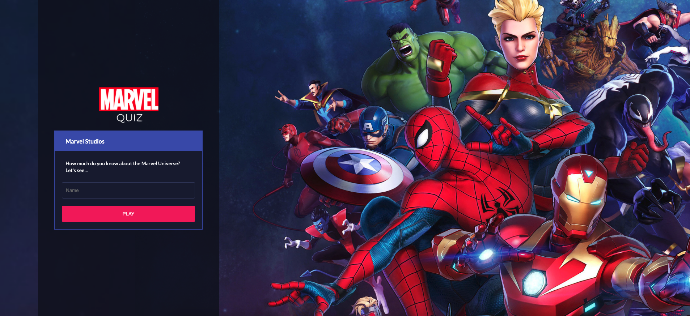
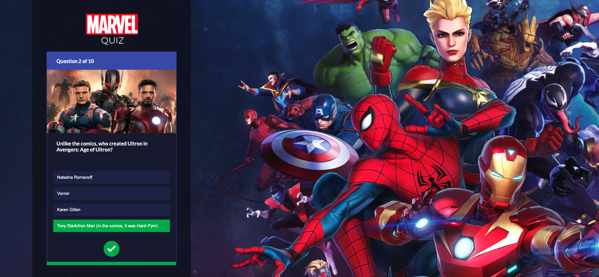
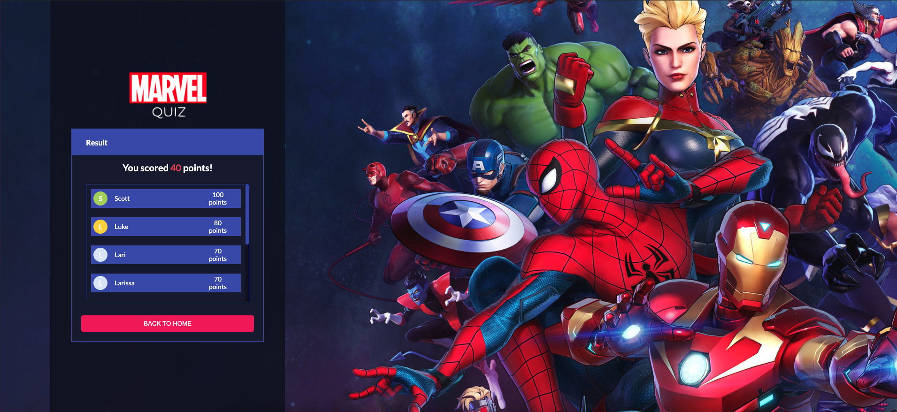

<h1 align="center">
  <br>

  <br>
  Marvel Quiz
  <br>
</h1>

<h4 align="center">A quiz for lovers of Marvel</h4>

<p align="center">
  <a href="#tecnologies">Tecnologies</a> •
  <a href="#how-to-run">How To Run</a>
</p>

<div align="center">
  <br>
  </a>
  </a>
  </a>

</div>

## Tecnologies

- NextJS
- Styled Components
- Json Server

## How To Run

To clone and run this application, you'll need [Git](https://git-scm.com) and [Node.js](https://nodejs.org/en/download/) (which comes with [npm](http://npmjs.com)) installed on your computer. From your command line:

```bash
# Clone this repository
$ git clone https://github.com/LarissaDornelas/marvel-quiz

# Go into the repository
$ cd marvel-quiz

# Install dependencies
$ npm install
```

After following all the steps you can start the server with this command line:

```bash

$ npm start:server
```

And start the application with this command line:

```bash

$ npm start
```

Note: If you're using Linux Bash for Windows, [see this guide](https://www.howtogeek.com/261575/how-to-run-graphical-linux-desktop-applications-from-windows-10s-bash-shell/) or use `node` from the command prompt.
